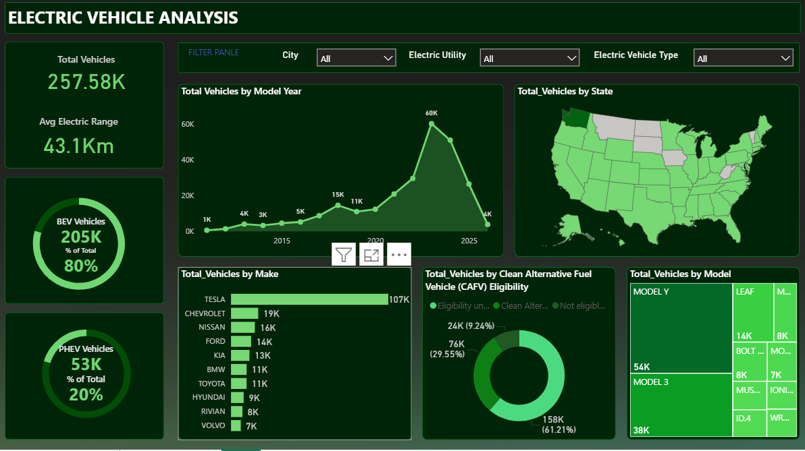

🚗⚡ Electric Vehicle Adoption & Trends Dashboard 

📌 Project Overview

This Power BI project analyzes Electric Vehicle (EV) adoption trends across states, manufacturers, and vehicle types to understand growth patterns, adoption rates, and key metrics driving the EV revolution.

The dashboard provides actionable insights into total EV counts, BEV vs. PHEV adoption, average range trends, and regional distribution, making it useful for policy makers, automotive companies, and utility providers.

🛠️ Tools & Technologies

Power BI – Data visualization and reporting

Power Query – Data cleaning & transformation

DAX – Custom calculations & KPIs

📊 Data Details

The dataset includes the following fields:

Vehicle Type: BEV (Battery Electric Vehicle), PHEV (Plug-in Hybrid Electric Vehicle)

Model Year: Manufacturing year of the vehicle

Manufacturer: Vehicle company name

City & State: Location of registered vehicles

Electric Utility: Power provider details

Range: Average driving range per charge

📈 Key Metrics (DAX Calculations)

Total Vehicles = COUNT of all EVs

BEV Count & % = Total BEVs and share in total EVs

PHEV Count & % = Total PHEVs and share in total EVs

Average Range = AVERAGE of EV range values

📉 Visualizations Included

KPI Cards → Total Vehicles, BEV %, PHEV %, Avg Range

Trend Line → EV Adoption by Model Year

Donut/Pie Charts → BEV vs PHEV Distribution

Bar Charts → Adoption by City/State, Manufacturer share

🚀 Insights

BEVs dominate the EV market share compared to PHEVs.

Regional trends highlight cities with the highest adoption rates.

Avg range improving steadily across model years.
